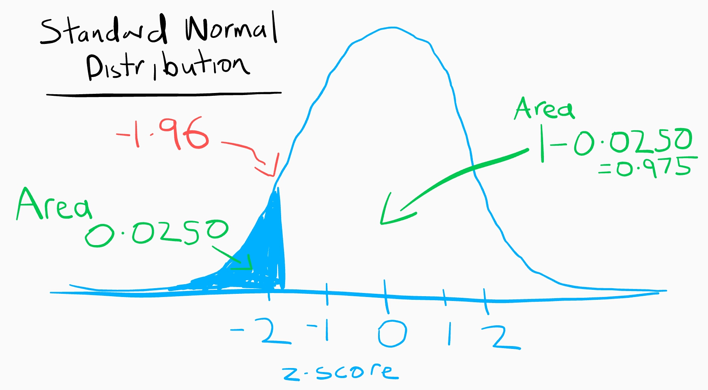

# Introduction

I am writing this blog as part of an assignment. My Details:

 |
------------- | -------------
Student Name: | B Kent
Student Number: | cxxxxxxxx
Programme Code: | TU060
Version R: | R version 4.0.3 (2020-10-10)
R packages: | 


# Getting started

We explore a student exam performance data set. This is a data set about secondary school academical achievements in Portugal. The data contains two sets of results, one set for results in Maths and one set for results in Portuguese. These are merged together to form one data set which I will endeavor to break down in order to learn about the basic properties of statistics, describing the frequencies and probabilities, hypothesis testing, Normality, Missing data, Relationships, Component Analysis and more. 

This data set is from a paper by P.Cortez and A. Silva entitled "Using  Data  Mining  to  Predict  Secondary  School  Student  Performance". [@cortez2008using]


We need to get the data

```r
library("dplyr")
```

```
## 
## Attaching package: 'dplyr'
```

```
## The following objects are masked from 'package:stats':
## 
##     filter, lag
```

```
## The following objects are masked from 'package:base':
## 
##     intersect, setdiff, setequal, union
```

```r
library("tidyr")
library("viridis")
```

```
## Loading required package: viridisLite
```

```r
library("finalfit") # for ff_glimpse(studentdf)
library("gridExtra") # for plots in a grid
```

```
## 
## Attaching package: 'gridExtra'
```

```
## The following object is masked from 'package:dplyr':
## 
##     combine
```

```r
library("ggplot2") # For creating histograms and plots
library("GGally") # for other plots
```

```
## Registered S3 method overwritten by 'GGally':
##   method from   
##   +.gg   ggplot2
```

```r
library("stargazer")#For formatting outputs/tables
```

```
## 
## Please cite as:
```

```
##  Hlavac, Marek (2018). stargazer: Well-Formatted Regression and Summary Statistics Tables.
```

```
##  R package version 5.2.2. https://CRAN.R-project.org/package=stargazer
```

```r
# and other libraries used in this File
library("semTools")
```

```
## Loading required package: lavaan
```

```
## This is lavaan 0.6-7
```

```
## lavaan is BETA software! Please report any bugs.
```

```
## 
```

```
## ###############################################################################
```

```
## This is semTools 0.5-3
```

```
## All users of R (or SEM) are invited to submit functions or ideas for functions.
```

```
## ###############################################################################
```

```r
library("sjstats")
library("car")
```

```
## Loading required package: carData
```

```
## Registered S3 methods overwritten by 'car':
##   method                          from
##   influence.merMod                lme4
##   cooks.distance.influence.merMod lme4
##   dfbeta.influence.merMod         lme4
##   dfbetas.influence.merMod        lme4
```

```
## 
## Attaching package: 'car'
```

```
## The following object is masked from 'package:dplyr':
## 
##     recode
```

```r
library("stats")
library("effectsize")
```

```
## 
## Attaching package: 'effectsize'
```

```
## The following objects are masked from 'package:sjstats':
## 
##     cohens_f, phi
```

```r
library("FSA")
```

```
## ## FSA v0.8.30. See citation('FSA') if used in publication.
## ## Run fishR() for related website and fishR('IFAR') for related book.
```

```
## 
## Attaching package: 'FSA'
```

```
## The following object is masked from 'package:car':
## 
##     bootCase
```

```
## The following object is masked from 'package:sjstats':
## 
##     se
```

```r
library("gmodels")
```

```
## 
## Attaching package: 'gmodels'
```

```
## The following object is masked from 'package:sjstats':
## 
##     ci
```

```r
library("knitr")
library("pastecs")
```

```
## 
## Attaching package: 'pastecs'
```

```
## The following object is masked from 'package:tidyr':
## 
##     extract
```

```
## The following objects are masked from 'package:dplyr':
## 
##     first, last
```

```r
library("psych")
```

```
## 
## Attaching package: 'psych'
```

```
## The following object is masked from 'package:FSA':
## 
##     headtail
```

```
## The following object is masked from 'package:effectsize':
## 
##     phi
```

```
## The following object is masked from 'package:car':
## 
##     logit
```

```
## The following object is masked from 'package:sjstats':
## 
##     phi
```

```
## The following object is masked from 'package:semTools':
## 
##     skew
```

```
## The following object is masked from 'package:lavaan':
## 
##     cor2cov
```

```
## The following objects are masked from 'package:ggplot2':
## 
##     %+%, alpha
```

```r
library("rstatix")
```

```
## 
## Attaching package: 'rstatix'
```

```
## The following objects are masked from 'package:effectsize':
## 
##     cohens_d, eta_squared
```

```
## The following object is masked from 'package:stats':
## 
##     filter
```

```r
library("sjstats")
library("stargazer")
library("userfriendlyscience")
```

```
## Registered S3 methods overwritten by 'ufs':
##   method                     from               
##   grid.draw.ggProportionPlot userfriendlyscience
##   pander.associationMatrix   userfriendlyscience
##   pander.dataShape           userfriendlyscience
##   pander.descr               userfriendlyscience
##   pander.normalityAssessment userfriendlyscience
##   print.CramersV             userfriendlyscience
##   print.associationMatrix    userfriendlyscience
##   print.confIntOmegaSq       userfriendlyscience
##   print.confIntV             userfriendlyscience
##   print.dataShape            userfriendlyscience
##   print.descr                userfriendlyscience
##   print.ggProportionPlot     userfriendlyscience
##   print.meanConfInt          userfriendlyscience
##   print.multiVarFreq         userfriendlyscience
##   print.normalityAssessment  userfriendlyscience
##   print.regrInfluential      userfriendlyscience
##   print.scaleDiagnosis       userfriendlyscience
##   print.scaleStructure       userfriendlyscience
##   print.scatterMatrix        userfriendlyscience
```

```
## 
## Attaching package: 'userfriendlyscience'
```

```
## The following objects are masked from 'package:FSA':
## 
##     is.even, is.odd
```

```
## The following object is masked from 'package:semTools':
## 
##     reliability
```

```r
library("lmtest")
```

```
## Loading required package: zoo
```

```
## 
## Attaching package: 'zoo'
```

```
## The following objects are masked from 'package:base':
## 
##     as.Date, as.Date.numeric
```

```r
library("Epi")
library("DescTools")
```

```
## Registered S3 method overwritten by 'DescTools':
##   method         from 
##   reorder.factor gdata
```

```
## 
## Attaching package: 'DescTools'
```

```
## The following objects are masked from 'package:psych':
## 
##     AUC, ICC, SD
```

```
## The following object is masked from 'package:car':
## 
##     Recode
```

```r
library("arm")
```

```
## Loading required package: MASS
```

```
## 
## Attaching package: 'MASS'
```

```
## The following object is masked from 'package:rstatix':
## 
##     select
```

```
## The following object is masked from 'package:dplyr':
## 
##     select
```

```
## Loading required package: Matrix
```

```
## 
## Attaching package: 'Matrix'
```

```
## The following objects are masked from 'package:tidyr':
## 
##     expand, pack, unpack
```

```
## Loading required package: lme4
```

```
## 
## Attaching package: 'lme4'
```

```
## The following object is masked from 'package:Epi':
## 
##     factorize
```

```
## The following object is masked from 'package:userfriendlyscience':
## 
##     getData
```

```
## 
## arm (Version 1.11-2, built: 2020-7-27)
```

```
## Working directory is /home/kent/git/blog/content/posts/2020-11-01-portfolio
```

```
## 
## Attaching package: 'arm'
```

```
## The following objects are masked from 'package:psych':
## 
##     logit, rescale, sim
```

```
## The following object is masked from 'package:effectsize':
## 
##     standardize
```

```
## The following object is masked from 'package:car':
## 
##     logit
```

```r
library("generalhoslem")
```

```
## Loading required package: reshape
```

```
## 
## Attaching package: 'reshape'
```

```
## The following object is masked from 'package:Matrix':
## 
##     expand
```

```
## The following objects are masked from 'package:tidyr':
## 
##     expand, smiths
```

```
## The following object is masked from 'package:dplyr':
## 
##     rename
```

```r
#download.file(url="https://archive.ics.uci.edu/ml/machine-learning-databases/00320/student.zip", destfile="student.zip")
#unzip("student.zip",exdir = "studentdf")
list.files("studentdf")
```

```
## [1] "student-mat.csv" "student-merge.R" "student-por.csv" "student.txt"
```

data set description: [https://archive.ics.uci.edu/ml/datasets/student+performance#](https://archive.ics.uci.edu/ml/datasets/student+performance#) or [here](/blog/description/)

read in the data

```r
matdf=read.table("studentdf/student-mat.csv",sep=";",header=TRUE, stringsAsFactors=TRUE)
pordf=read.table("studentdf/student-por.csv",sep=";",header=TRUE, stringsAsFactors=TRUE)

studentdf=merge(x=matdf,y=pordf,by=c("school","sex","age","address","famsize","Pstatus","Medu","Fedu","Mjob","Fjob","reason","nursery","internet"))
colnames(studentdf) <- tolower(colnames(studentdf))
nrow(studentdf)
```

```
[1] 382
```

So we have 382 records in our data set. 

Let's see what variables we have in each record.

```r
colnames(studentdf)
```

```
##  [1] "school"       "sex"          "age"          "address"      "famsize"     
##  [6] "pstatus"      "medu"         "fedu"         "mjob"         "fjob"        
## [11] "reason"       "nursery"      "internet"     "guardian.x"   "traveltime.x"
## [16] "studytime.x"  "failures.x"   "schoolsup.x"  "famsup.x"     "paid.x"      
## [21] "activities.x" "higher.x"     "romantic.x"   "famrel.x"     "freetime.x"  
## [26] "goout.x"      "dalc.x"       "walc.x"       "health.x"     "absences.x"  
## [31] "g1.x"         "g2.x"         "g3.x"         "guardian.y"   "traveltime.y"
## [36] "studytime.y"  "failures.y"   "schoolsup.y"  "famsup.y"     "paid.y"      
## [41] "activities.y" "higher.y"     "romantic.y"   "famrel.y"     "freetime.y"  
## [46] "goout.y"      "dalc.y"       "walc.y"       "health.y"     "absences.y"  
## [51] "g1.y"         "g2.y"         "g3.y"
```


The data set measures the grades for each students achievements at three time intervals, g1, g2 and g3. So grades at g1 and g2 can been used to predict g3, and from the paper, it can be seen that there is a strong correlation between g3 and g2/g1.

let's us pick a random student:

```r
studentdf %>% 
  sample_n(1) 
```

```
##   school sex age address famsize pstatus medu fedu  mjob  fjob reason nursery
## 1     GP   M  15       U     GT3       T    2    3 other other   home      no
##   internet guardian.x traveltime.x studytime.x failures.x schoolsup.x famsup.x
## 1      yes     mother            1           3          0         yes       no
##   paid.x activities.x higher.x romantic.x famrel.x freetime.x goout.x dalc.x
## 1    yes           no      yes         no        5          3       2      1
##   walc.x health.x absences.x g1.x g2.x g3.x guardian.y traveltime.y studytime.y
## 1      2        5          4   11   10   11     mother            1           3
##   failures.y schoolsup.y famsup.y paid.y activities.y higher.y romantic.y
## 1          0         yes       no     no           no      yes         no
##   famrel.y freetime.y goout.y dalc.y walc.y health.y absences.y g1.y g2.y g3.y
## 1        5          3       2      1      2        5          2   10    9    9
```
## Population vs Sample

We are interested in finding results for the entire population of students that have completed exams in maths and Portuguese in Portugal, but we know that is not possible, so what we have is a sample. We will use this sample to infer things about the population as a whole. 

The numbers used to describe a population are called parameters, whereas for our sample which is a subset of the pollution, we call them statistics. 

Samples are collected because there are easier to contact, less time consuming and less costly. 

However taking samples as shortcut to finding out answers about a population is always prone to sampling error.  

We now need to ask ourselves some questions. 

* Does our sample represent the population well?
* Is our sample biased? 

In order to answer these questions, we need to explore the data. The first thing we know is that the size of the data set is 382. Usually the bigger the sample the more likely it is to reflect the whole population. It is not enough to simply use the number of records to tell us whether we have a sample that represents the population. 

We need to have some understanding of the population in order to make this decision about our sample representing the population. First thing we know is that this data comes from two Portuguese schools, so if we find some statistics from this data set, we can't say that this applies to students all over the world. We can only use this results as a pointer to further research. 

We ask ourselves this question, because in the end we want to be able to create a model that describes the population, not a model which only describes the sample.

We will show later that there are many statistical tests we can do on a sample set of data to see if we can infer anything about the population. Also we will show that through the use of hypotheses testing we can decide whether there is a relationship in the sample data that is strong enough to use to model the relationship in the population. 

Now to the 2nd question, a biased sample is one which differs from the population from which it is taken. This can happen if the sample is not collected randomly. If the students in this sample were picked, then it would not be a representative sample. 
There is a limit to this randomness, we have to acknowledge that, looking at the paper[@cortez2008using], we see that data was only collected during one year and only in two public schools. This year and these schools might not represent the population's Portugese school system in other parts of the country and in other years. Doing a quick Google search I can see that these schools are in rural and less dense areas of Portugal. 

<iframe src="https://www.google.com/maps/embed?pb=!1m18!1m12!1m3!1d3194283.005649975!2d-10.17086483750003!3d38.57024409999999!2m3!1f0!2f0!3f0!3m2!1i1024!2i768!4f13.1!3m3!1m2!1s0xd19e50ed36b8271%3A0xa2f44287b70a82c0!2sEscola%20Gabriel%20pereira!5e0!3m2!1sen!2sie!4v1604499877562!5m2!1sen!2sie" width="300" height="450" frameborder="0" style="border:0;" allowfullscreen="" aria-hidden="false" tabindex="0"></iframe>
<iframe src="https://www.google.com/maps/embed?pb=!1m18!1m12!1m3!1d4445653.247860987!2d-10.805082784867597!3d39.909816886764695!2m3!1f0!2f0!3f0!3m2!1i1024!2i768!4f13.1!3m3!1m2!1s0x0%3A0x39781f2296c8dbc3!2sMouzinho%20da%20Silveira%20High%20School!5e0!3m2!1sen!2sie!4v1604501863240!5m2!1sen!2sie" width="300" height="450" frameborder="0" style="border:0;" allowfullscreen="" aria-hidden="true" tabindex="0"></iframe>

<div class="figure" style="text-align: center">

<p class="caption">(\#fig:unnamed-chunk-5)Population density of Portugal @wikiportmap</p>
</div>

We can also check the if the sample percentages match what we would imagine for a population, for example:
Let checks the students involved, are both sexes represented  
counts:

```
## sex
##   F   M 
## 198 184
```
Percentages

```
## sex
##     F     M 
## 51.83 48.17
```

It is very important that when choosing a sample that any missing data is also random, that there is not pattern between the variables which are missing. 

The most common types of Bias in data are:

1. Selection Bias - When analyzing the data, I need to make sure I am not using only certain groups of students. 
2. Sampling Bias - caused if there is not random sampling, I assume some students did not give details or choose not to join, we miss these.
3. Time interval Bias - our data was taken in 2014. It's hard to say it still applies to now(2020), a lot has changed in student behaviour. 
4. Confirmation Bias - I didn't choose this data, so I hope to avoid any confirmation bias.
5. Omitted Variable Bias - there are many other variables which are not included which could be affecting grade results, such as stress, poverty etc. 

To make good decisions to the questions outlined above, we will calculate some simple statistics for our sample. These statistics we will start to examine in the next section.

## How to infer from a sample to a population

In order to show how well a sample is representing a population we need to understand some basics about the variables in our data set.
Each variable falls into a "level of Measurement" category. There are 4 levels:

* Nominal - or Categorical, can we binary variables such as dead or alive or nominal like Guinness, Harp, Smithwicks.
* Ordinal - kinda of the same as nominal but have an order, like A,B,C for an exam result. 
* Interval - have a score and the differences between these scores are equivalent. 
* Ratio - same as interval but the score of say 12 must mean twice a score of 6. 0 has a meaning. 

So depending on the variable of interest in the record, we can make small basic models to see if we can infer information about the population from it. The first is mean. First thing we should note is that you can only get a mean from variable which are either interval or Ratio (these types are referred to as numeric in [here](/blog/description/)). The other types types such as Nominal and Ordinal don't have a mean. They use other statistics to describe what we call a Central Tendency. Here is a table to explain:

level | Mode | Median | Mean
---|---|---|---
Nominal | yes | no | no 
Ordinal | yes | yes | no 
Interval | yes | yes | yes 
Ratio | yes | yes | yes 

The best measure of Central Tendency is Mean if it is available for that level. If not, then median and if not median then mode. However whether to choose mean or median depends on another term called "skew". If a variable has skew then median may be better than mode. 

To explain these levels, we will use examples in our data set. An example of a Nominal variable, a Numeric variable and a Ratio variable. 

Ratio in the student data set is "g3"
```
32 G3 - final grade (numeric: from 0 to 20, output target)
```
Nominal in student data set is "reason"
```
11 reason - reason to choose this school (nominal: close to "home", school "reputation", "course" preference or "other")
```
Ordinal in student data set is "studytime"
```
14 studytime - weekly study time (numeric: 1 - <2 hours, 2 - 2 to 5 hours, 3 - 5 to 10 hours, or 4 - >10 hours)
```

## G3 - Final Grade (Ratio)

In this section we will explore the variable G3 in our data set. The Grade G3 variable is a ratio variable because zero has a meaning in this variable. The grade results begins at zero and a student who got 16 did twice as well as a student who received 8. 

### Normal Distrubution  

We would like to find a variable which has a normal distribution, because we can use parametric tests on this variable. This is ideal when we want to make inference from our sample to our population. These parametric tests are more powerful because they use all values a variable has. Let's check if grade results fits the bill for us. 

Finally we get to draw a chart. First the humble scatter plot:
<div class="figure">

<p class="caption">(\#fig:unnamed-chunk-8)G3 - final grade unsorted</p>
</div>


Or if we sort the grades in ascending order.
<div class="figure">

<p class="caption">(\#fig:unnamed-chunk-9)G3 - final grade sorted</p>
</div>

We can see here that there are grade marked as 0. We don't know if that means the student didn't do the exam or they got 0 after attempting it. That's 10.21 % of the data. 

To understand skew we need to starting visualizing the data. We do this by plotting what is known as a frequency distribution or histogram.  
<div class="figure">

<p class="caption">(\#fig:unnamed-chunk-10)G3 - final grade histogram</p>
</div>

From the Frequency distribution chart we can say that the zeros are outliers here, as we said above. WHy? because we expect the distribution for grade results to be normal, to match what we call a [Normal Distrbtion](https://www.mathsisfun.com/data/standard-normal-distribution.html). All normal distributions are symmetric and have bell-shaped density curves with a single peak. This histogram above is bimodal because of the zeros. We will remove those now, for all grade results. 


These zeros which we find the grade results could also be a result of missing data. 
and now again we check the histogram

<div class="figure">

<p class="caption">(\#fig:unnamed-chunk-12)G3 - final grade histogram no zeros</p>
</div>

This is much better. Let's check the Central Tendency measure for this variable

### Central Tendency 
For G3 - final grade in maths

stat|desc|value
--|--|--
mean| average |  11.5685131
median| ranked in order of magnitude, find middle |  11

### Dispersion 
For G3 - final grade in maths

stat|desc|value
--|--|--
Range | lowest and highest | 4, 20
Quantiles | cut in 1/4ths | 4, 9, 11, 14, 20
1st quantile | 1st 1/4 |  4
Interquartile Range | cut off the 1st 1/4 and last 1/4| 5
Variance |The average of the squared differences from the Mean | 10.772339
Standard deviation | the square root of the variance | 3.2821242

There are two main ways in which a distribution can deviate from normal: 

1. lack of symmetry (called **skew** ) and 
2. pointyness (called **kurtosis** )

Like plot the histogram again and add a normal distribution curve using the grade scores:
<div class="figure">

<p class="caption">(\#fig:unnamed-chunk-13)G3 - final grade histogram with normal curve</p>
</div>

From a look at this histogram we can say that the Skew is visible. We can see that there is positive skew. 
The kurtosis does not look to be a problem. 

We not need to examine that skew in detail. There is another useful graph that we can inspect to see if a distribution is normal called a
Q-Q plot (quantile–quantile plot). A quantile is the proportion of cases we find below a certain value.

<div class="figure">

<p class="caption">(\#fig:unnamed-chunk-14)G3 - final grade Q-Q plot</p>
</div>

The closer the values fall on the diagonal of the plot, the closer the fit we have for a normal distribution.

We can get values now for Skew and kurtosis. The values of skew and kurtosis should be zero
in a normal distribution. Positive values of skew indicate a postive skew. Positive values of
kurtosis indicate a pointy distribution, whereas negative values indicate a flat distribution.


Generating some summary statistics of the varaible. There are two libraries in R for this:
using psych::describe :

```r
knitr::kable(stack(psych::describe(studentdf$g3.x)))
```


|      values|ind      |
|-----------:|:--------|
|   1.0000000|vars     |
| 343.0000000|n        |
|  11.5685131|mean     |
|   3.2821242|sd       |
|  11.0000000|median   |
|  11.5018182|trimmed  |
|   2.9652000|mad      |
|   4.0000000|min      |
|  20.0000000|max      |
|  16.0000000|range    |
|   0.2096557|skew     |
|  -0.4840774|kurtosis |
|   0.1772180|se       |

using pastecs::stat.desc :


```r
options(scipen=999)
knitr::kable(pastecs::stat.desc(studentdf$g3.x, basic = FALSE, norm = TRUE))
```


|             |          x|
|:------------|----------:|
|median       | 11.0000000|
|mean         | 11.5685131|
|SE.mean      |  0.1772180|
|CI.mean.0.95 |  0.3485745|
|var          | 10.7723390|
|std.dev      |  3.2821242|
|coef.var     |  0.2837118|
|skewness     |  0.2096557|
|skew.2SE     |  0.7960411|
|kurtosis     | -0.4840774|
|kurt.2SE     | -0.9216168|
|normtest.W   |  0.9787651|
|normtest.p   |  0.0000598|

We divide the skew statistic by the standard error to get the standardised core for skew and kurtosis
using semTools::skew :

```r
tpskew<-semTools::skew(studentdf$g3.x)
tpskew
```

```
## skew (g1)        se         z         p 
## 0.2115020 0.1322600 1.5991380 0.1097899
```
and semTools::kurtosis :

```r
tpkurt<-semTools::kurtosis(studentdf$g3.x)
tpkurt
```

```
## Excess Kur (g2)              se               z               p 
##     -0.45855837      0.26452003     -1.73354877      0.08299818
```

Skew and kurtosis are converted to z-scores by dividing by the standard error:

```r
tpskew[1]/tpskew[2]
```

```
## skew (g1) 
##  1.599138
```

```r
tpkurt[1]/tpkurt[2]
```

```
## Excess Kur (g2) 
##       -1.733549
```
Before exploring skew and kurtosis, we need to understand a key term "Confidence interval" and "Z-score"

### Confidence interval

In statistics we use confidence intervals to show how sure we are that a value would fall in a range of values. 

The common confidence intervals used are 90%, 95% and 99%. The idea is based on the Normal distribution. To say we are 95% confidence a value will fall into a range of values is the same as saying it will fall inside -1.96 standard deviations and +1.96 standard deviations of the mean.  A 90% chance would correspond to 1.645 and a 99% chance would correspond to 2.576 deviations. 

Which confidence interval we decide to use depends on the population variance and also the size of the sample. A wide variance in a population would mean a large confidence interval. Certain industries use different confidence intervals to report their results when they are doing tests to answers questions. For example pharmaceutical science or manufacturing companies may have a tighter cut off value.  These tests usually involves fitting a statistical model to data and testing a prediction. To decide if the model works, they need to know if the result is statistically significant. To do this the confidence intervals are used, if the test result is outside these intervals, or above a certain alpha value (usually 0.05), it unlikely the model is getting the right answer by chance. We will discuss this more later in hypothesis testing. For educational data sets such as the one we are currently analyzing a standard alpha value is 0.05 because we are working with human beings and because of the measurement error in recording the values. 

### Z-score
We only need the standard deviation and mean to use Confidence Intervals. To help us understand what are the critical values and their related probabilities. We need to standardize our Normal Distribution. To do this, we use z-scores. A standard Normal distribution has a mean of zero and standard deviation of one. The z-score is a number on the horizontal which corresponds to a number of standard deviations. So a z-score of 3 means that we are 3 standard deviations from the mean to the right. A z-score also comes with a z-score table, we can use this to calculate the area under the standard normal distribution, this area will give us a probability (and of course there is tools in R to help so we never really need to check a table, although could be useful with electricity goes out). If our distribution is normal for a give variable, then these z-score make it real easy to see for each value the probability of getting that value and the distance the value is from the mean. 

<!-- The significance level is an expression of how rare your results are, under the assumption that the null hypothesis is true. It is usually expressed as a “p-value,” and the lower the p-value, the less likely the results are due purely to chance. -->

The critical values for a 95% confidence is -1.96 or +1.96 as we said above, these are the values in terms of z-score or standard deviations. If we get a z-score higher or lower than this, we know that that value is statistically unlikely. 

<div class="figure">

<p class="caption">(\#fig:unnamed-chunk-21)Standard Normal Distribution</p>
</div>

In the diagram above, you can see how a 95% confidence interval relates to a 1.96 z-score. 2.5% of the area is shaded in in blue, twice that on each side is 5% which is 100% - 5%.

In green you can also see the area which are divided by the -1.96 z-score. These areas are the probabilities or p-values of a event falling into that z-score range. 

### skew and kurtosis analysis

We would expect the calculation of skew and kurtosis to be at least less than approx absolute 2 (1.96 for a 95% confidence interval at p < .05). So what we need to do is check the z-score of skew. 
Above we calculated a skew of 1.599138. Putting that on our magnificent Standard Normal Distribution figure below. We see it falls in the p < 0.05 range. 
<div class="figure">

<p class="caption">(\#fig:unnamed-chunk-22)Standard Normal Distribution for skew and kurtosis</p>
</div>

We also calculated a kurtosis of -1.733549.

Sometimes a skew and kurtosis maybe outside our confidence range, however Discovery Statistics with R -@field2012discovering estimates that if we have a sample size of 200 or more, it may be more important to look at the shape of the distribution and pay less attention to these scores above. 

We say the z-value is significant if it is in those blue regions of the figure above. Significant means important and in the case of skew or kurtosis it's not good if it is very significant. 

*Another way*
Using skew.2SE from pastecs::stat.desc

We can determine if the skew is significant also, skew.2SE is 0.79604109916. This statistic is the skew divided by 2 standard errors. For this to be significant. skew.2SE must be greater than ~1 (or 1.96/2 which is 0.98). It's not. 

Using kurt.2SE from pastecs::stat.desc

kurtosis divided by 2 standard errors we have -0.92161679721. Again kurtosis is just greater than -1 or we could say the absolute value is less than 1. 

*Another way*

In other to show another way of testing for skew and kurtosis which is called the Shapiro–Wilk test, we need an introduction to Hypothesis testing. 

### Hypothesis Testing

We make a hypothesis about the outcome of some experiment. We can make an example from our data set, let's say students who have more "studytime" achieve better grades ("g3"). 

We do the experiment. It's already done, because we have the data. 

**H**<sub>**0**</sub>: The **Null hypothesis** would be that "studytime" has no affect on grade results, that "studytime" makes no difference.  

**H**<sub>**1**</sub>: The **Alternative hypothesis** would be the hypothesis we made above, that students who have more "studytime" achieve better grades.


Afterwards...

For both these hypothesisesesss:

We can either reject the hypothesis(we were wrong) or fail to reject the hypothesis(we are not completely wrong).

We would really like to reject the Null hypothesis. 

In order to decide if we reject or fail to reject, we run the data through sometime called a statistical test.

There are two types of errors which can result form a hypothesis test
1. type I: when we reject the Null hypothesis when it is true, probability of committing a type I error is called the significance level, also called alpha. alpha for us is usually 0.05. But it's depends on the area/industry. False Positive
2. type II: when we fail to reject the Null hypothesis when it is false, probability of committing a type I error is called beta. The probability of not committing type II is called the power. False Negative

I liked Wikipedia's description of these:
type I: "an innocent person is convicted"
type II: "a guilty person is not convicted"

<div class="figure">

<p class="caption">(\#fig:unnamed-chunk-23)Type I and Type II Errors</p>
</div>

The strength of the evidence of is determined by the measureed p-value of the test and by the region of acceptance.  

### Shapiro–Wilk test

Another way to check if our variable has a normal distribution is do the Shapiro–Wilk test. 

This test compares the mean and standard deviation of our data to a normally distributed set of scores withe h same mean and standard deviation. 


```r
shapiro.test(studentdf$g3.x)
```

```
## 
## 	Shapiro-Wilk normality test
## 
## data:  studentdf$g3.x
## W = 0.97877, p-value = 0.00005978
```

The test result shows the test statistic and the p-value. 

The Null hypothesis is that there is no normal distribution in this data, it's just random stuff. 
The alternative hypothesis is that it's a normal distribution.

Our result has a very small p-value, so the probability that the Null hypothesis is true is tiny, so we can accept the Alternative. 

A p-value of less than 0.05 is statistically significant here, so if our p-value was greater than 0.05. We could not reject **H**<sub>**0**</sub>.

This test along with the Kolmogorov-Smirnov test are usually not the greatest indicators to a varaible being non-normal. 
The best way to test for normality is outlined already in the section [dispersion]. When testing again for normality I will refer to this section. 

### Using Normal Distribution to find outliers 
Now by calculating the percentage of standardized scores for the variable itself that are outside our acceptable range
we can see how far they are away from being normal. 
Calculate the percentage of standardised scores that are greater than 1.96

```r
ztpcoiss<- abs(scale(studentdf$g3.x))

FSA::perc(as.numeric(ztpcoiss), 1.96, "gt")
```

```
## [1] 4.081633
```

```r
FSA::perc(as.numeric(ztpcoiss), 2.58, "gt")
```

```
## [1] 0
```

```r
FSA::perc(as.numeric(ztpcoiss), 3.29, "gt")
```

```
## [1] 0
```
So 4% of our data lies outside 1.96 standard deviations of the mean or outside the 95% confidence range.
0% are outside of the 99% confidence interval and of course that means also 0% of our data lies outside the 99.9% confidence interval. 

95% of our data is within the acceptable range, so we can treat the data as normal. :relieved:

Since our sample size is larger than 80, a case is an outlier if it's standard score is +/- 3.29. So we have no outliers. HOwever at the moment we are ignoring missing data, that's thr values we made NA earlier. 


### G3 Grades Summary 

Heuristic| value
--|--
Standarised score of skew | 1.599138 
Standarised score of kurtosis | -1.733549 
Standarised score of variables | 4.1 % outside +/- 1.96
Standarised score of variables | 0% outside +/- 3.29 (no outliers)
Currently ignoring missing data. | 

## Reason (Nominal)

Reason has the following description in the data set.
```
11 reason - reason to choose this school (nominal: close to "home", school "reputation", "course" preference or "other")
```
As we explained earlier it is nominal because there is no ordering or direction in this variable. In the R language we call this column a factor. 

The best way to visualize this variable is to use a pie chart, bar chart or a frequency table. 
<div class="figure">

<p class="caption">(\#fig:unnamed-chunk-27-1)Count Pie chart for 11 reason</p>
</div>

```
##       reason   n
## 1     course 140
## 2       home 110
## 3      other  34
## 4 reputation  98
```

<div class="figure">

<p class="caption">(\#fig:unnamed-chunk-27-2)Count Pie chart for 11 reason</p>
</div>


## Studytime (Ordinal)

Studytime has the following description in the data set.
```
14 studytime - weekly study time (numeric: 1 - <2 hours, 2 - 2 to 5 hours, 3 - 5 to 10 hours, or 4 - >10 hours)
```
It is ordinal because it has an order, but it is not interval because the different between each value is not the same, also we can't add or subtract values.  

From the join we did earlier with the data from the two subject, we have two columns of studytime, one for Maths(x) and one for Portuguese(y). Let's compare them. 

```r
print("Length of studytime.x")
length(studentdf$studytime.x)
a <- is.na(studentdf$studytime.x)
print("Number of NA values in studytime.x")
length(a[a==TRUE])
print("Length of studytime.y")
length(studentdf$studytime.y)
a <- is.na(studentdf$studytime.y)
print("Number of NA values in studytime.y")
length(a[a==TRUE])
print("Are they equal? how many of different? ")
a <- sort(studentdf$studytime.x) == sort(studentdf$studytime.y)
length(a[a==FALSE])
```

```
## [1] "Length of studytime.x"
## [1] 382
## [1] "Number of NA values in studytime.x"
## [1] 0
## [1] "Length of studytime.y"
## [1] 382
## [1] "Number of NA values in studytime.y"
## [1] 0
## [1] "Are they equal? how many of different? "
## [1] 2
```

Ok, so 2 values in 382. Very similar. But we can see if are not dealing with exactly the same students. 

In R, we can add the information from the levels in the description of studytime.x to the variable and we can do this for all similar type variables. 
In R these are known as ordinal factors. 

```r
studentdf$medu = factor(studentdf$medu,levels=c(0:4),labels = c("0 - none","1 - primary education (4th grade)","2 – 5th to 9th grade","3 – secondary education","4 – higher education"), ordered=T)
studentdf$fedu = factor(studentdf$fedu,levels=c(0:4),labels = c("0 - none","1 - primary education (4th grade)","2 – 5th to 9th grade","3 – secondary education","4 – higher education"), ordered=T)
studentdf$traveltime.x = factor(studentdf$traveltime.x,levels=c(1:4),labels = c("1 - <15 min", "2 - 15 to 30 min", "3 - 30 min. to 1 hour", "4 - >1 hour"), ordered=T)
studentdf$traveltime.y = factor(studentdf$traveltime.y,levels=c(1:4),labels = c("1 - <15 min", "2 - 15 to 30 min", "3 - 30 min. to 1 hour", "4 - >1 hour"), ordered=T)
studentdf$studytime.x = factor(studentdf$studytime.x,levels=c(1:4),labels = c("1 - <2 hours","2 - 2 to 5 hours", "3 - 5 to 10 hours","4 - >10 hours"), ordered=T)
studentdf$studytime.y = factor(studentdf$studytime.y,levels=c(1:4),labels = c("1 - <2 hours","2 - 2 to 5 hours", "3 - 5 to 10 hours","4 - >10 hours"), ordered=T)
```


## Missing Data

Missing data can come as a result of sampling bias or selection bias. Missing data reduces the probability that the test will reject 
**H**<sub>**0**</sub>. 

We can take a quick look at our data set and see if we have many NA values.

```r
t <- sapply(studentdf, function(x) sum(is.na(x)))
t[t>0]
```

```
## g2.x g3.x g1.y g3.y 
##   13   39    1    5
```

It is no surprise here at there is not many NAs. Looking back to [Get started] we merged the Maths and Portuguese results together using the variables "school","sex","age","address","famsize","Pstatus","Medu","Fedu","Mjob","Fjob","reason","nursery","internet" 

Which means if any of these are missing, we won't have them in our combined data frame.  That means alot of the Portuguese grade data is not contained in the merged data frame. 

Missing data reduces also how well sample represents the population, if we had a lot of missing data, it could also lead to invalid conclusions.  

There are three possible patterns to missing data:

1. Data missing at random (MAR) - missing data is not random, but not related to other variables
2. Data missing completely at random (MCAR) - missing data is random, best scenario!
3. Data not missing at random (MNAR) - not random, related to other variables, pretty serious!

Let us check if any of these patterns are seen in the data. The only variables with missing data are the grade results: g2 and g3 for Maths.  

```r
studentdf %>% filter(is.na(g3.x)) %>% summary()
```

```
##  school  sex         age        address famsize  pstatus
##  GP:34   F:23   Min.   :15.00   R: 9    GT3:34   A: 2   
##  MS: 5   M:16   1st Qu.:16.00   U:30    LE3: 5   T:37   
##                 Median :17.00                           
##                 Mean   :17.05                           
##                 3rd Qu.:18.00                           
##                 Max.   :19.00                           
##                                                         
##                                 medu                                   fedu   
##  0 - none                         : 0   0 - none                         : 0  
##  1 - primary education (4th grade): 8   1 - primary education (4th grade):13  
##  2 – 5th to 9th grade             :14   2 – 5th to 9th grade             :10  
##  3 – secondary education          : 9   3 – secondary education          : 6  
##  4 – higher education             : 8   4 – higher education             :10  
##                                                                               
##                                                                               
##        mjob          fjob           reason   nursery  internet  guardian.x
##  at_home : 9   at_home : 3   course    :20   no : 9   no : 7   father: 9  
##  health  : 2   health  : 0   home      :13   yes:30   yes:32   mother:26  
##  other   :15   other   :21   other     : 1                     other : 4  
##  services: 7   services:11   reputation: 5                                
##  teacher : 6   teacher : 4                                                
##                                                                           
##                                                                           
##                 traveltime.x            studytime.x   failures.x    
##  1 - <15 min          :22    1 - <2 hours     :13   Min.   :0.0000  
##  2 - 15 to 30 min     :12    2 - 2 to 5 hours :17   1st Qu.:0.0000  
##  3 - 30 min. to 1 hour: 4    3 - 5 to 10 hours: 6   Median :1.0000  
##  4 - >1 hour          : 1    4 - >10 hours    : 3   Mean   :0.9231  
##                                                     3rd Qu.:1.5000  
##                                                     Max.   :3.0000  
##                                                                     
##  schoolsup.x famsup.x paid.x   activities.x higher.x romantic.x    famrel.x    
##  no :38      no :14   no :31   no :19       no : 7   no :19     Min.   :1.000  
##  yes: 1      yes:25   yes: 8   yes:20       yes:32   yes:20     1st Qu.:3.000  
##                                                                 Median :4.000  
##                                                                 Mean   :3.795  
##                                                                 3rd Qu.:5.000  
##                                                                 Max.   :5.000  
##                                                                                
##    freetime.x       goout.x          dalc.x          walc.x     
##  Min.   :1.000   Min.   :1.000   Min.   :1.000   Min.   :1.000  
##  1st Qu.:3.000   1st Qu.:2.000   1st Qu.:1.000   1st Qu.:1.000  
##  Median :3.000   Median :3.000   Median :1.000   Median :1.000  
##  Mean   :3.103   Mean   :3.128   Mean   :1.333   Mean   :1.821  
##  3rd Qu.:4.000   3rd Qu.:4.000   3rd Qu.:2.000   3rd Qu.:2.000  
##  Max.   :5.000   Max.   :5.000   Max.   :3.000   Max.   :5.000  
##                                                                 
##     health.x       absences.x      g1.x             g2.x             g3.x    
##  Min.   :1.000   Min.   :0    Min.   : 4.000   Min.   : 5.000   Min.   : NA  
##  1st Qu.:2.500   1st Qu.:0    1st Qu.: 6.000   1st Qu.: 5.250   1st Qu.: NA  
##  Median :4.000   Median :0    Median : 7.000   Median : 7.000   Median : NA  
##  Mean   :3.641   Mean   :0    Mean   : 7.462   Mean   : 7.115   Mean   :NaN  
##  3rd Qu.:5.000   3rd Qu.:0    3rd Qu.: 9.000   3rd Qu.: 8.750   3rd Qu.: NA  
##  Max.   :5.000   Max.   :0    Max.   :12.000   Max.   :10.000   Max.   : NA  
##                                                NA's   :13       NA's   :39   
##   guardian.y                traveltime.y            studytime.y
##  father: 9   1 - <15 min          :20    1 - <2 hours     :13  
##  mother:26   2 - 15 to 30 min     :13    2 - 2 to 5 hours :17  
##  other : 4   3 - 30 min. to 1 hour: 5    3 - 5 to 10 hours: 6  
##              4 - >1 hour          : 1    4 - >10 hours    : 3  
##                                                                
##                                                                
##                                                                
##    failures.y     schoolsup.y famsup.y paid.y   activities.y higher.y
##  Min.   :0.0000   no :37      no :15   no :38   no :17       no : 7  
##  1st Qu.:0.0000   yes: 2      yes:24   yes: 1   yes:22       yes:32  
##  Median :0.0000                                                      
##  Mean   :0.3333                                                      
##  3rd Qu.:0.0000                                                      
##  Max.   :3.0000                                                      
##                                                                      
##  romantic.y    famrel.y       freetime.y       goout.y          dalc.y     
##  no :19     Min.   :1.000   Min.   :1.000   Min.   :1.000   Min.   :1.000  
##  yes:20     1st Qu.:3.000   1st Qu.:3.000   1st Qu.:2.000   1st Qu.:1.000  
##             Median :4.000   Median :3.000   Median :3.000   Median :1.000  
##             Mean   :3.846   Mean   :3.205   Mean   :3.179   Mean   :1.308  
##             3rd Qu.:5.000   3rd Qu.:4.000   3rd Qu.:4.000   3rd Qu.:2.000  
##             Max.   :5.000   Max.   :5.000   Max.   :5.000   Max.   :3.000  
##                                                                            
##      walc.y         health.y       absences.y          g1.y      
##  Min.   :1.000   Min.   :1.000   Min.   : 0.000   Min.   : 5.00  
##  1st Qu.:1.000   1st Qu.:3.000   1st Qu.: 0.000   1st Qu.: 9.00  
##  Median :2.000   Median :4.000   Median : 4.000   Median :11.00  
##  Mean   :1.897   Mean   :3.615   Mean   : 5.179   Mean   :10.62  
##  3rd Qu.:2.000   3rd Qu.:5.000   3rd Qu.: 6.500   3rd Qu.:12.00  
##  Max.   :5.000   Max.   :5.000   Max.   :22.000   Max.   :16.00  
##                                                                  
##       g2.y            g3.y      
##  Min.   : 7.00   Min.   : 6.00  
##  1st Qu.: 9.00   1st Qu.:10.00  
##  Median :11.00   Median :12.00  
##  Mean   :10.67   Mean   :11.43  
##  3rd Qu.:12.00   3rd Qu.:13.00  
##  Max.   :14.00   Max.   :15.00  
##                  NA's   :2
```

Because our data set is relatively large, we don't expect missing data to have a serious impact. It all goes back to being representative of the population. 

In R we have a library called finalfit which has the function ff_glimpse, which we can use to identify missing data.


